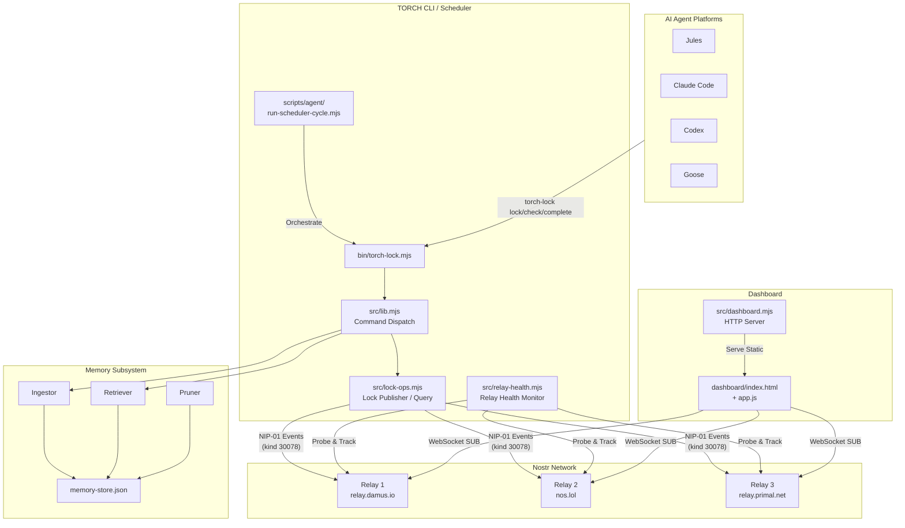
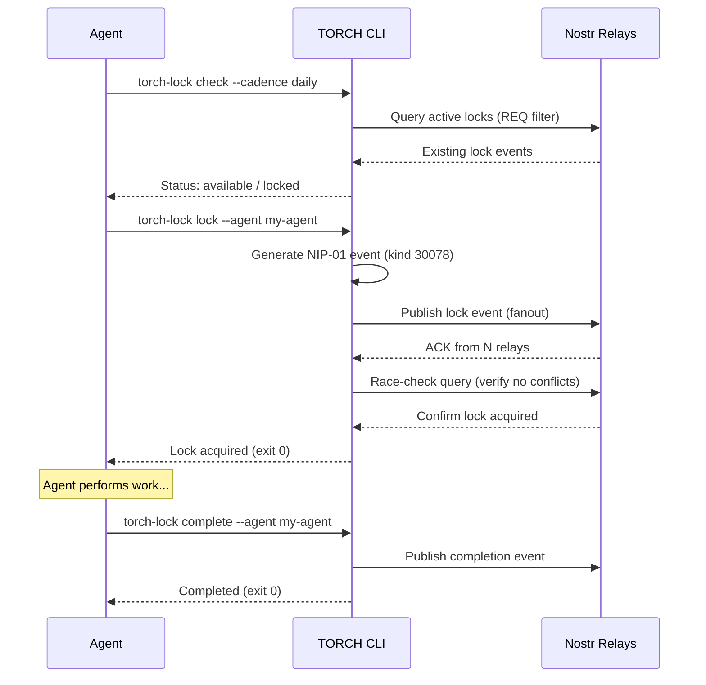
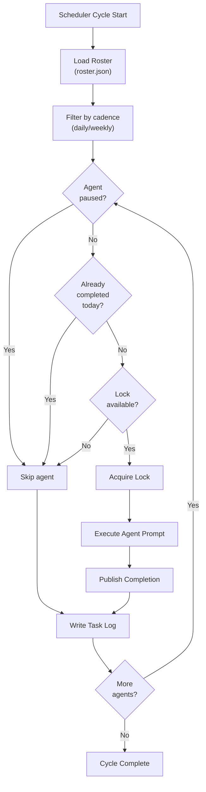
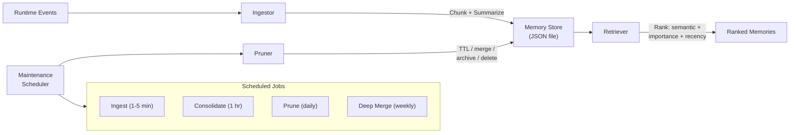

# TORCH System Architecture

## High-Level Overview



## Lock Lifecycle



## Scheduler Flow



## Memory Subsystem



## Key Data Flows

| Flow | Protocol | Event Kind | Key Fields |
|------|----------|-----------|------------|
| Lock acquire | NIP-01 publish | 30078 | d-tag, expiration, agent, cadence, status |
| Lock query | NIP-01 REQ | 30078 | #t filter on hashtag |
| Lock complete | NIP-01 publish | 30078 | status: "completed" |
| Dashboard feed | NIP-01 WebSocket | 30078 | Real-time SUB with since filter |

## Directory Structure

```
TORCH/
├── bin/                    # CLI entry point
├── src/
│   ├── lib.mjs             # Command dispatch
│   ├── lock-ops.mjs        # Nostr relay operations
│   ├── relay-health.mjs    # Relay health monitoring
│   ├── dashboard.mjs       # Dashboard HTTP server
│   ├── ops.mjs             # Install/update operations
│   ├── services/
│   │   ├── memory/         # Memory subsystem
│   │   └── governance/     # Governance service
│   └── prompts/            # Agent prompt definitions
├── dashboard/              # Dashboard frontend
├── scripts/agent/          # Scheduler and agent scripts
├── test/                   # Test suite
├── docs/                   # Architecture documentation
└── migrations/             # Database schemas (future)
```
